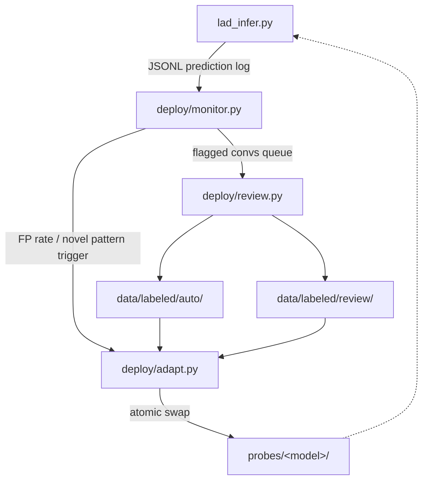

# Deployment loop (Appendix N)

Reference implementation of the LAD production architecture from Section N
of the paper. Three small daemons that together close the adaptation loop:



## Components

| Script | Role | Section |
|---|---|---|
| `monitor.py` | Tail prediction log, compute sliding-window FP rate, fire retrain | N.3 |
| `review.py`  | Hybrid LLM+human review queue for flagged conversations | N.1 step 3 |
| `adapt.py`   | Re-extract activations on labeled data, retrain, atomic probe swap | N.1 step 4, N.2 |

## Prediction log format

`lad_infer.py --log <path>` writes one JSON line per user turn:

```json
{"ts": "2026-05-10T14:23:11Z", "conv_id": "abc123", "turn": 7,
 "p_adv": 0.84, "flagged": true, "model": "qwen1.5b"}
```

A human label can be appended later by `review.py`:
```json
{"ts": "...", "conv_id": "abc123", "label": "benign",
 "labeler": "human|auto", "agree": true}
```

The two streams (predictions + labels) are joined by `monitor.py` on
`conv_id` to compute the sliding-window FP rate.
